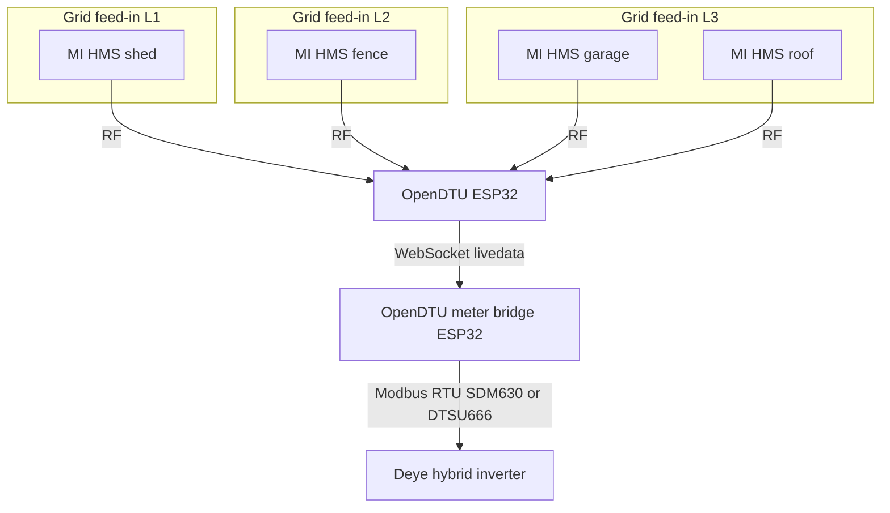
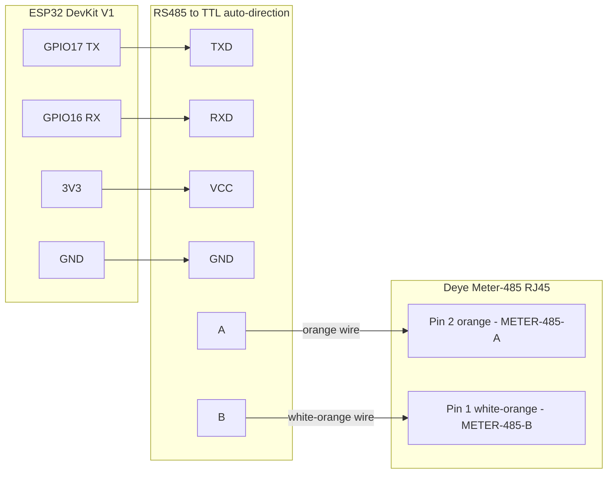

# ESPHome OpenDTU Meter Bridge

<!--
SPDX-License-Identifier: Apache-2.0

Licensed under the Apache License, Version 2.0 (the "License"),
you may not use this file except in compliance with the License.
You may obtain a copy of the License at

    http://www.apache.org/licenses/LICENSE-2.0

Unless required by applicable law or agreed to in writing, software
distributed under the License is distributed on an "AS IS" BASIS,
WITHOUT WARRANTIES OR CONDITIONS OF ANY KIND, either express or implied.
See the License for the specific language governing permissions and
limitations under the License.
-->


ESPHome external component that reads Hoymiles microinverter data from [OpenDTU](https://github.com/tbnobody/OpenDTU) and presents instantaneous measurements to a hybrid inverter using a Modbus RTU **Eastron SDM630** or **CHINT DTSU666** register profile.

> **Note:** The SDM630 profile was developed and tested with Deye. The DTSU666 profile is implemented from the published [CHINT Modbus specification](https://www.deyeinverter.com/deyeinverter/2022/06/10/chintthreephase-instructionmanual-dt%28s%29su666-y0.464.1002v1.5190617.pdf). Its phase active-power block has been exercised with Deye configured for CHNT and Grid Tie Meter 2, but it has not been compared with physical DTSU666 hardware.

## Why this project exists

This component was built for **Deye 3-phase hybrid inverters** in **AC Couple on Load Side** mode - when additional Hoymiles microinverters inject PV on the load side, separate from the inverter's own MPPT strings.

In that mode Deye needs a supported energy meter, such as **Eastron SDM630** or **CHINT DTSU666**, to measure how much power the microinverters inject into the installation. The inverter uses those per-phase values to separate **AC-coupled PV generation** from **grid import/export** and to calculate **household load** correctly. A physical meter is installed on the **AC conductors where the microinverter system ties into the grid**, with readings delivered over the **Meter-485** Modbus port.

Instead of mounting a physical compatible meter on the AC cabling, this bridge:

- Uses **OpenDTU** for **wireless** communication with Hoymiles microinverters - no RS485 or extra meter wiring across the site
- Aggregates **AC-coupled PV** from **many microinverters** at **different coupling points** into one emulated meter - Deye exposes only **one** Grid Tie Meter 2 interface on Meter-485, so you cannot wire a separate meter at each distant feed-in. OpenDTU radio reach plus this bridge can still combine them
- Reads live data from OpenDTU over **WebSocket** (`/livedata`) as often as OpenDTU publishes it (up to once per second, depending on the OpenDTU poll interval)
- Maps each microinverter to the correct grid phase (L1/L2/L3)
- Exposes the result as an **SDM630** or **DTSU666** Modbus slave on the Deye Meter-485 port

That lets Deye **meter AC-coupled PV generation** and **calculate household load** correctly - without affecting OpenDTU operation. OpenDTU continues to poll and manage all microinverters as before, this bridge only subscribes to the livedata stream. Frequent livedata updates (up to once per second) keep instantaneous measurements aligned with the microinverters. Without correct coupled-PV metering, household load can read as **negative** or **no consumption at all** while microinverters are producing - on some Deye firmware/settings negative values are simply clamped to zero rather than displayed.

## How it works



Each microinverter (**MI**) only needs radio reach to **OpenDTU**. The bridge sums per-phase active, reactive and apparent power plus current from every mapped inverter and encodes the result using the selected meter profile.

- Parses all electrical fields supplied by the OpenDTU AC channel (`inverters[].AC["0"]` → voltage, current, active power, reactive power, power factor and frequency)
- Reads production, temperature and efficiency from each mapped inverter's `inverters[].INV["0"]` channel; the bridge does not use OpenDTU's global total, which can include unmapped inverters
- Maps microinverters to grid phases via `microinverter_map` (several inverters can share a phase; current, active power, reactive power and apparent power are summed, voltage and frequency are averaged)
- Inverts the OpenDTU generation sign for directional values: active power is negative for export in both profiles, SDM630 retains directional current for compatibility, and DTSU666 exposes positive RMS current as required by its register map
- Serves the selected meter register window on `slave_address` (`0x02` for Deye Grid Tie Meter 2), silently ignoring Deye queries to `0x01` (main meter address)

## Requirements

> **Current scope:** Only **single-phase Hoymiles** microinverters managed by OpenDTU are supported at this time.

- [OpenDTU](https://github.com/tbnobody/OpenDTU) running and reachable on your network (WebSocket `/livedata`, dashboard password), with **single-phase Hoymiles** microinverters
- A **second ESP32** for this bridge (separate from the OpenDTU ESP32 in the tested setup)
- RS485-to-TTL converter (no DE/RE pin required in the tested setup)
- ESPHome **≥ 2025.6.3**
- **Modbus master** (e.g. Deye hybrid inverter with Grid Tie Meter 2 and Eastron or CHNT meter type) reading **Eastron SDM630** or **CHINT DTSU666** over Modbus RTU (**9600 8N1**)
- **Home Assistant is not required** - ESPHome alone is enough to build, flash, and run this component

## Tested setup

| Layer | Details |
|-------|---------|
| OpenDTU | [tbnobody/OpenDTU](https://github.com/tbnobody/OpenDTU) **v26.3.30**, Poll Interval **1 s** (DTU Settings), on **ESP32 DevKit V1** |
| Microinverters | Hoymiles **HMS-2000-4T** and **HMS-1600-4T**, each on a separate grid phase (3-phase supply) |
| Deye inverter | **SUN-12K-SG04LP3-EU**, firmware **1172**, Grid Tie Meter 2 enabled, energy meter type **Eastron** (Advanced Settings), polls Grid Tie Meter 2 at fixed address **`0x02`** |
| This bridge | **ESP32 DevKit V1**, **RS485-to-TTL auto-direction** converter, `slave_address: 0x02` to match Deye Grid Tie Meter 2 |
| SDM630 profile | Validated with the Deye setup above |
| DTSU666 profile | Phase active-power block exercised with Deye configured for CHNT and Grid Tie Meter 2; not compared with physical DTSU666 hardware |

Deye uses **fixed Modbus slave addresses** - they are not configurable in the inverter menu:

| Address | Role |
|---------|-----------|
| `0x01` | Main / grid energy meter |
| `0x02` | Grid Tie Meter 2 (AC-coupled PV measurement) |

For AC Couple on Load Side with **Grid Tie Meter 2** enabled, Deye polls **`0x02`** for instantaneous per-phase measurements from the coupled microinverter system. The emulated meter must answer on that address - Deye does not allow choosing a different slave ID. Deye may also scan **`0x01`** for the main grid-side meter.

## Wiring



Connect the inverter with a standard twisted pair. From the RS485 converter, use only **A** (orange) and **B** (white-orange) to the inverter Modbus terminals. Connect ESP32 **GPIO17 → TXD**, **GPIO16 → RXD**, **3V3 → VCC**, **GND → GND** on the converter. Some modules label the same pins **DI**/**RO** instead of **TXD**/**RXD**.

The tested setup uses an auto-direction module - no `flow_control_pin` needed. If your converter requires DE/RE control, uncomment and set `flow_control_pin` under the `modbus:` block in your YAML.

## Configuration reference

All options under `opendtu_meter_bridge:`:

| Option | Required | Default | Purpose |
|--------|----------|---------|---------|
| `host` | yes | - | OpenDTU IP address or hostname |
| `password` | yes | - | OpenDTU dashboard password (`!secret`) |
| `modbus_id` | yes | - | ESPHome `modbus:` hub ID (`role: server`) |
| `microinverter_map` | yes | - | Map microinverters to grid phases |
| `port` | no | `80` | OpenDTU HTTP port |
| `path` | no | `/livedata` | WebSocket path |
| `username` | no | `admin` | WebSocket authentication username |
| `meter_profile` | no | `sdm630` | Register profile: `sdm630` (Eastron SDM630) or `dtsu666` (CHINT DTSU666) |
| `slave_address` | no | `0x02` | Modbus slave address of the emulated meter |
| `data_timeout` | no | `15s` | Stale-data threshold before fallback values are used |
| `default_voltage` | no | `230.0` | Fallback voltage per phase [V] |
| `default_frequency` | no | `50.0` | Fallback grid frequency [Hz] |
| `publish_sensors` | no | `true` | Publish ESPHome entities for monitoring |

### microinverter_map

Each entry requires `grid_phase` (`1` = L1, `2` = L2, `3` = L3) and **exactly one** identifier:

- `serial` - microinverter serial from OpenDTU livedata (`inverters[].serial`), stable if you rename the inverter in OpenDTU
- `name` - microinverter name from OpenDTU livedata (`inverters[].name`)

`serial` and `name` cannot be used in the same entry.

`grid_phase` is the **installation phase (L1/L2/L3)** where that microinverter's AC output contributes to coupled PV. Multiple microinverters on the same phase: **active current and power are summed**, **voltage is averaged**. Grid frequency is averaged across mapped microinverters, if unavailable, `default_frequency` is used.

Example:

```yaml
opendtu_meter_bridge:
  host: 192.168.1.50
  password: !secret opendtu_password
  modbus_id: modbus_1
  # Change here: sdm630 = Eastron SDM630, dtsu666 = CHINT DTSU666.
  meter_profile: dtsu666
  slave_address: 0x02
  microinverter_map:
    - name: "Garage-HMS-2000-4T"
      grid_phase: 1
    - serial: "123456789012"
      grid_phase: 2
```

### Auto-created entities

When `publish_sensors: true` (default), the component registers:

- L1/L2/L3 voltage, current, and power sensors
- L1/L2/L3 and total reactive-power sensors (`ReactivePower` from OpenDTU)
- L1/L2/L3 and total apparent-power sensors (derived from OpenDTU active power and power factor)
- L1/L2/L3 and total power-factor sensors (aggregated from active and apparent power)
- Total production today [Wh] and total lifetime production [kWh], summed across mapped microinverters
- Average mapped-inverter temperature and aggregate inverter efficiency
- Total active-power and frequency sensors
- **WebSocket Status** and **WebSocket Data Valid** (diagnostic binary sensors)
- **Board Restart** button and **Component Version** text sensor (diagnostic)

Set `publish_sensors: false` if you only need Modbus output and no Home Assistant entities.

Individual sensor names and options can be overridden inside the `opendtu_meter_bridge:` block.

### Failsafe behaviour

When the WebSocket disconnects, JSON parsing fails, or no fresh data arrives within `data_timeout`, the bridge reports **zero coupled PV** - active power and current on all phases are set to `0.0`. Voltage falls back to `default_voltage` and frequency to `default_frequency`. Phases without a mapped microinverter always report `0.0` for power and current.

### Modbus registers

The bridge accepts Modbus **FC03 (Read Holding Registers)** and **FC04 (Read Input Registers)** requests. The physical DTSU666 specification defines FC03; FC04 is also accepted by the bridge for compatibility with masters that treat meter measurements as input registers. Write functions are not implemented.

Measurements use IEEE-754 FP32 values in two consecutive 16-bit registers, with the high word first and big-endian bytes (`ABCD`). Each profile exposes one contiguous read window:

- SDM630: `0x0000` through `0x017F` (`0x0180` registers)
- DTSU666: `0x2000` through `0x2045` (`0x0046` registers)

Addresses inside the selected profile window that are not listed below return zero-filled registers. A request outside the selected window or one that crosses its end is rejected with Modbus exception **`0x02` (Illegal Data Address)**. A zero-length request or one exceeding 125 registers is rejected with **`0x03` (Illegal Data Value)**.

Read requests are limited to the Modbus maximum of 125 registers. Active and reactive power keep their direction: OpenDTU generation/export is exposed as a negative value. DTSU666 current registers expose the positive RMS magnitude defined by the CHINT map, while the SDM630 profile retains the legacy directional-current behavior for compatibility.

#### Eastron SDM630 (`meter_profile: sdm630`)

| Address | Value |
|---------|-------|
| 0x0000 | Voltage L1 [V] |
| 0x0002 | Voltage L2 [V] |
| 0x0004 | Voltage L3 [V] |
| 0x0006 | Current L1 [A] |
| 0x0008 | Current L2 [A] |
| 0x000A | Current L3 [A] |
| 0x000C | Active Power L1 [W] |
| 0x000E | Active Power L2 [W] |
| 0x0010 | Active Power L3 [W] |
| 0x0034 | Total Active Power [W] |
| 0x0046 | Frequency [Hz] |

#### CHINT DTSU666 (`meter_profile: dtsu666`)

Line-to-line voltages are derived from the available phase-to-neutral voltages. The CHINT specification defines scaled IEEE-754 values for these instantaneous registers, unlike the direct engineering units used by SDM630: voltage, active power and reactive power are stored as physical value × `10`; current as × `1000`; and frequency as × `100`. The component applies these scales before encoding the Modbus response, so the Deye receives the physical value specified by the DTSU666 profile.

| Address | Value |
|---------|-------|
| 0x2000 | Line Voltage Uab [V] |
| 0x2002 | Line Voltage Ubc [V] |
| 0x2004 | Line Voltage Uca [V] |
| 0x2006 | Voltage L1 [V] |
| 0x2008 | Voltage L2 [V] |
| 0x200A | Voltage L3 [V] |
| 0x200C | Current L1 [A] |
| 0x200E | Current L2 [A] |
| 0x2010 | Current L3 [A] |
| 0x2012 | Total Active Power [W] |
| 0x2014 | Active Power L1 [W] |
| 0x2016 | Active Power L2 [W] |
| 0x2018 | Active Power L3 [W] |
| 0x201A | Total Reactive Power Qt [var] |
| 0x2044 | Frequency [Hz] |

## secrets.yaml

1. Copy [`secrets.yaml.example`](secrets.yaml.example) to `secrets.yaml` in the same directory as your ESPHome YAML.
2. Fill in the four keys:

   ```yaml
   wifi_ssid: "YourWiFiSSID"
   wifi_password: "YourWiFiPassword"
   opendtu_password: "OpenDTUDashboardPassword"
   ota_password: "OTAPasswordForDevice"
   ```

3. Reference secrets in your YAML with `!secret`, for example `password: !secret opendtu_password`.

Never commit `secrets.yaml` - it is listed in [`.gitignore`](.gitignore).

## Using opendtu_meter_bridge.yaml

[`opendtu_meter_bridge.yaml`](opendtu_meter_bridge.yaml) is a **reference configuration** and a practical starting point. In most cases you will:

- Copy it as-is and adjust `host`, `microinverter_map`, and UART pins for your installation, or
- Merge its `opendtu_meter_bridge:`, `uart:`, and `modbus:` sections into an existing ESPHome device config.

The reference file pulls the component from GitHub:

```yaml
external_components:
  - source: github://Lewa-Reka/esphome-opendtu-to-sdm630@main
    components: [opendtu_meter_bridge]
```

It also includes WiFi, OTA, API, UART (TX=17, RX=16, 9600 baud), Modbus server, and optional diagnostic sensors. Change `meter_profile` under `opendtu_meter_bridge:` to `dtsu666` and select **CHNT** in Deye, or use `sdm630` with **Eastron**. The default is `sdm630`.

## Migration from `opendtu_sdm630`

Version 0.2.0 introduces the recommended meter-neutral `opendtu_meter_bridge` name. Existing v0.0.1-style configurations remain compatible through the `opendtu_sdm630` wrapper: they compile without changing the component list or YAML domain, emit a deprecation warning, and select SDM630 by default.

```yaml
# Compatible v0.0.1-style configuration on the 0.2.x codebase
external_components:
  - source: github://Lewa-Reka/esphome-opendtu-to-sdm630@main
    components: [opendtu_sdm630]

opendtu_sdm630:
  host: 192.168.1.50
  password: !secret opendtu_password
  modbus_id: modbus_1
  microinverter_map:
    - name: Garage-HMS-2000-4T
      grid_phase: 1
  # No selector is needed: the compatibility wrapper defaults to SDM630.
```

The recommended 0.2.x configuration uses the neutral component name and an explicit profile when needed:

```yaml
external_components:
  - source: github://Lewa-Reka/esphome-opendtu-to-sdm630@main
    components: [opendtu_meter_bridge]

opendtu_meter_bridge:
  host: 192.168.1.50
  password: !secret opendtu_password
  modbus_id: modbus_1
  # Allowed values: sdm630 or dtsu666.
  meter_profile: dtsu666
  microinverter_map:
    - name: Garage-HMS-2000-4T
      grid_phase: 1
```

The neutral domain supports both `meter_profile: sdm630` and `meter_profile: dtsu666`. The deprecated `meter_type` spelling is also accepted with the same two values and emits a warning; use `meter_profile` in every new configuration.

Compatibility policy: both deprecated aliases -- the `opendtu_sdm630` component/domain and the `meter_type` option -- remain supported throughout the complete 0.2.x release series. They may be removed no earlier than v0.3.0, with the removal announced in the changelog and release notes.

## Versioning and release guidance

- The `main` branch contains the current development line and can move as fixes are added.
- Until a reviewed upstream release is published, use `@main` for evaluation or pin a reviewed commit SHA for a reproducible build.
- After a release is published, production installations should pin its tag rather than follow `@main`.
- Compatibility changes, deprecations, and release contents are recorded in [CHANGELOG.md](CHANGELOG.md).

For local component development, point `external_components` to a local path instead:

```yaml
external_components:
  - source:
      type: local
      path: components
    components: [opendtu_meter_bridge]
```

## Adding another meter profile

Meter-specific register encoding is intentionally separated from OpenDTU collection and Modbus transport. To add a profile:

1. Add its public YAML value to `METER_PROFILES` in `components/opendtu_meter_bridge/__init__.py` and its C++ enum value to `meter_profile.h`.
2. Add the profile name, register-window start/count, and encoder dispatch in `meter_profile.cpp`.
3. Implement the register descriptor table in `meter_profile_<name>.cpp` and encode it through the shared `meter_profile_codec`. Add a `MeasurementSource` to `meter_profile_codec.h/.cpp` only when the profile needs a measurement transformation that the codec does not already provide. Do not duplicate FP32 byte-order, bounds-checking, RMS-current, or line-voltage logic in an individual profile.
4. If its register window is larger than the current shared capacity, update `METER_PROFILE_REGISTER_CAPACITY` in `meter_profile.h`.
5. Add a golden-vector case to `tests/meter_profile_test.cpp`, including exact register words and relevant boundary/window checks. Add a local ESPHome configuration, include it in the CI matrix, and document the register map and source specification.
6. Update every user-facing selector comment so it lists all supported values, including the reference YAML, README examples, and issue form.

Keep the profile implementation independent of WebSocket parsing and Modbus request handling. A new profile should only translate the normalized measurements into its documented register layout.

## Installation

Home Assistant is **optional**. You only need ESPHome to compile, flash, and update the firmware.

### Method 1: Home Assistant ESPHome add-on

1. Install the **ESPHome** add-on from the Home Assistant add-on store and open the dashboard.
2. Click **+ New Device**, name the device, select **ESP32**, and skip the template wizard.
3. Create `secrets.yaml` in your ESPHome config directory (see above).
4. Edit the new device and **replace its content** with [`opendtu_meter_bridge.yaml`](opendtu_meter_bridge.yaml), adjusted for your network and microinverters.
5. Click **Install**, connect the ESP32 via USB, select the serial port, and flash.
6. Wire the RS485 converter to the Deye Modbus port and power the ESP32.

The device will run independently of Home Assistant. HA is only used here as a convenient ESPHome UI.

### Method 2: ESPHome CLI

```bash
pip install esphome
cp secrets.yaml.example secrets.yaml   # edit before flashing
esphome run opendtu_meter_bridge.yaml
```

Useful follow-up commands:

```bash
esphome compile opendtu_meter_bridge.yaml
esphome upload opendtu_meter_bridge.yaml
esphome logs opendtu_meter_bridge.yaml
```

OTA updates work through the ESPHome dashboard or `esphome upload` over the network after the first flash.

## License

This project is licensed under the Apache License 2.0 - see the [LICENSE](LICENSE) file for details.

### Copyright Notice

```
Copyright 2026 Lewa-Reka <lewareka.yt@gmail.com>

Licensed under the Apache License, Version 2.0 (the "License"),
you may not use this file except in compliance with the License.
You may obtain a copy of the License at

    http://www.apache.org/licenses/LICENSE-2.0

Unless required by applicable law or agreed to in writing, software
distributed under the License is distributed on an "AS IS" BASIS,
WITHOUT WARRANTIES OR CONDITIONS OF ANY KIND, either express or implied.
See the License for the specific language governing permissions and
limitations under the License.
```

### Third-Party Components

This project uses ESPHome and related components. Please refer to the [NOTICE](NOTICE) file for additional license information.
